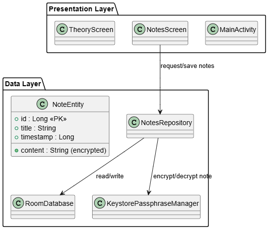
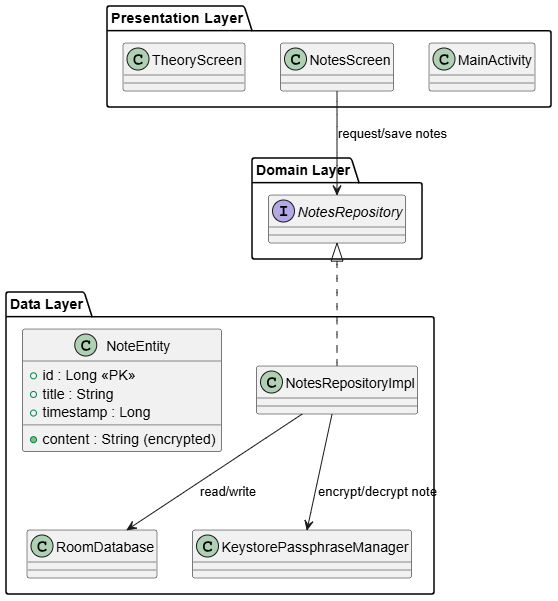

# Secure Notes Demo – Architecture

This document provides an overview of the **Secure Notes Demo** app architecture. It includes two diagrams: the **current architecture** and a **Clean Architecture style** with a Domain Layer as a potential future improvement.

---

## 1. Current Architecture

### Description

The current architecture of the app is simple and functional for a small demo. It consists of three main layers:

### Presentation Layer
- Includes `MainActivity`, `NotesScreen`, and `TheoryScreen`.
- Handles the user interface and user interactions.
- Requests data from the repository when needed and displays it.

### Data Layer
- Contains `NotesRepository`, `RoomDatabase`, and `NoteEntity`.
- `NotesRepository` acts as a bridge between the UI and the database.
- `KeystorePassphraseManager` handles encryption and decryption of note content before storage and after retrieval.

### Interactions
- The UI calls `NotesRepository` to fetch or save notes.
- `NotesRepository` interacts with `RoomDatabase` to persist data and uses `KeystorePassphraseManager` for encryption.

**Note:** There is no explicit Domain Layer in this version; business logic is simple and resides in the repository.

---

## 2. Architecture with Domain Layer

### Description

For larger or more complex applications, a **Domain Layer** can be introduced to improve separation of concerns:

### Domain Layer
- Contains an interface `NotesRepository` defining the operations the app can perform (e.g., add, update, delete notes).
- Encapsulates business rules and use cases.
- Independent of Android frameworks or database implementation, which makes it easier to test and maintain.

### Data Layer
- Implements the `NotesRepository` interface with `NotesRepositoryImpl`.
- Contains the actual database (`RoomDatabase`), entities (`NoteEntity`), and encryption helper (`KeystorePassphraseManager`).
- Responsible for converting between domain models and database entities.

### Benefits of Adding a Domain Layer
- **Clear separation of concerns**: UI depends on the interface, not on the concrete implementation.
- **Easier testing**: Domain logic can be tested independently from database or Android components.
- **Flexibility**: You can swap or extend repository implementations (e.g., network-based or mock) without affecting the UI.
- **Scalability**: Makes it easier to add new features and maintain the app as it grows.

**Note:** In the current demo, this split is not implemented yet. It is presented here as a recommended future improvement.
